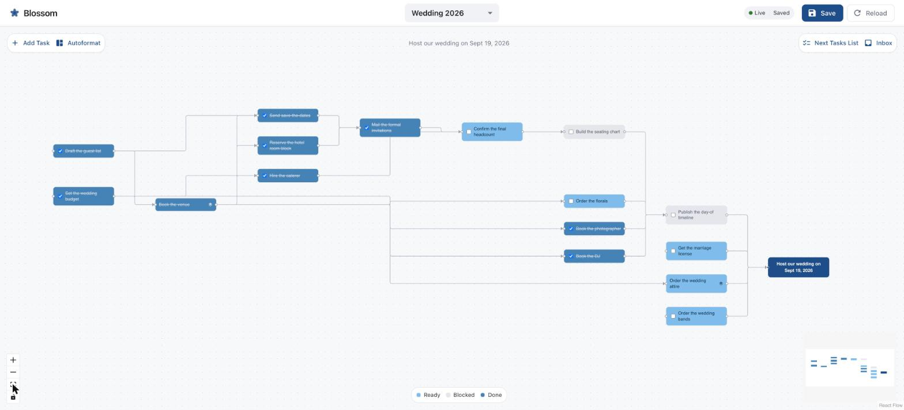
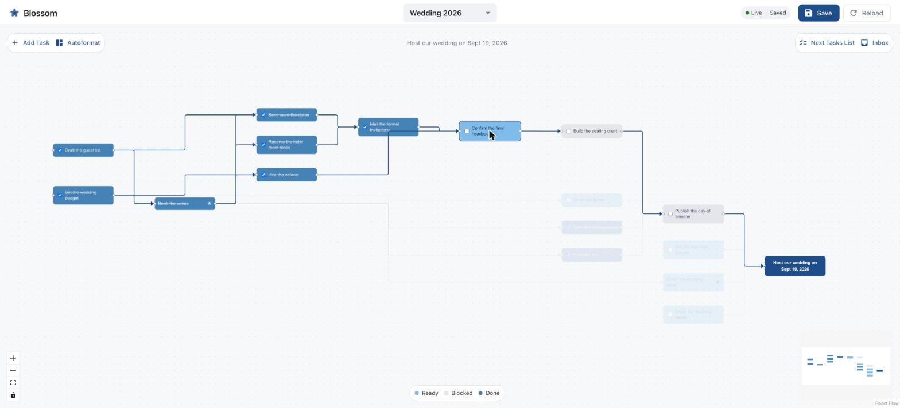
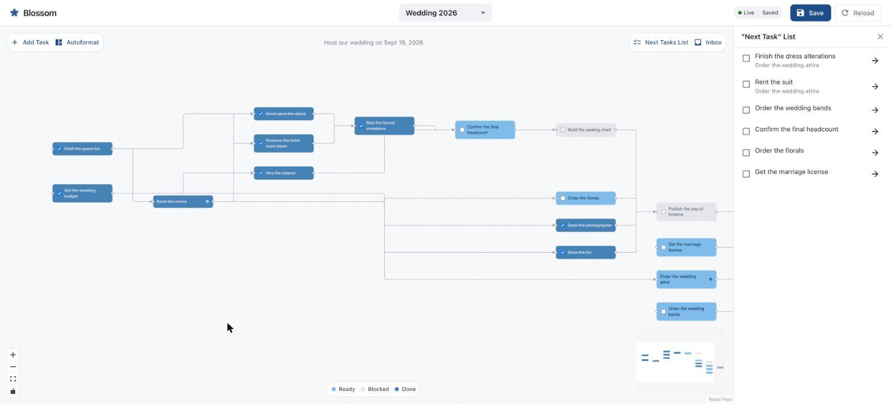
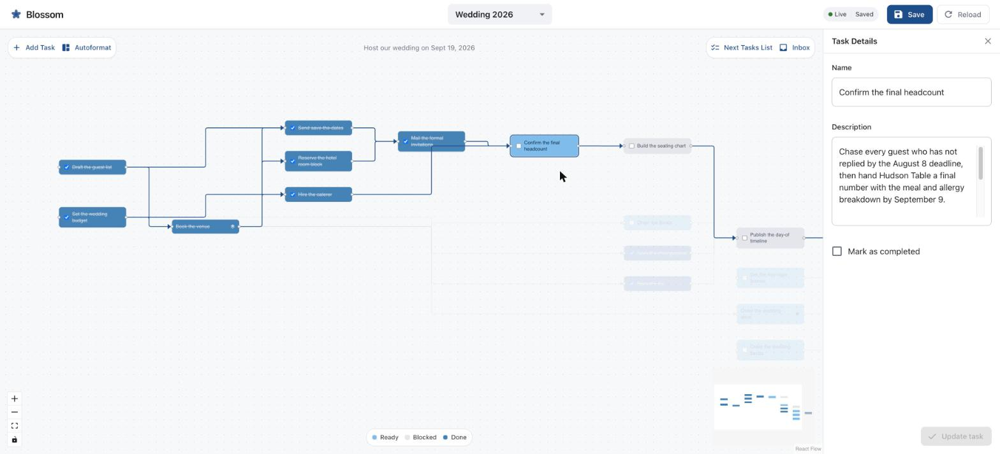
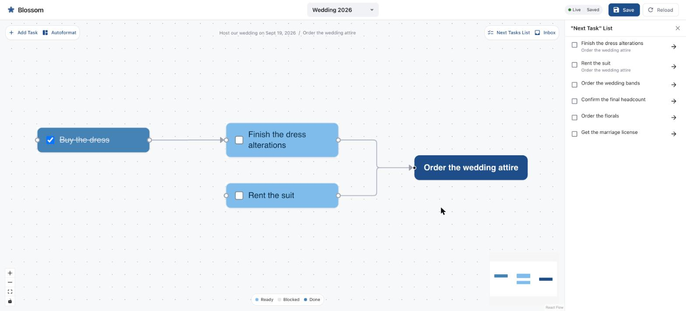
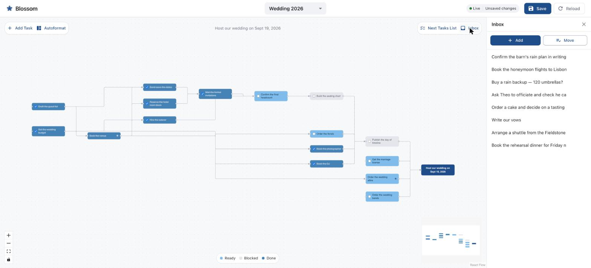

# Blossom

Blossom turns a conversation with an LLM into a project plan you can see.

You talk about the project in a chat application — Claude Desktop, Claude Code, anything that speaks MCP — and the model builds the plan by calling tools on Blossom's backend. The web UI holds that plan on screen and redraws as each change lands, so the graph in front of you is what the model just did.



## A worked example

The screenshots below all come from one project: a wedding at a Hudson Valley barn on September 19, 2026, for 120 guests on a $46,000 budget. It is roughly seven weeks out, so some of the plan is behind them and some is still live.

### The roadmap is a graph

Work flows left to right into the goal node. Each task carries the colour of its state: dark blue and struck through for done, mid blue for ready to start, pale grey for blocked by something upstream.

The picture above says the venue, caterer, photographer, DJ, hotel block and invitations are all settled, and that what is left hinges on one date: the RSVP deadline, with the seating chart and then the day-of timeline queued behind it. The marriage license, attire, rings and florals never depended on the guest count, so those run into the goal along their own paths.

### Follow one chain at a time

A dense plan is hard to read all at once. Click any node and Blossom walks the graph outwards in both directions — everything that task depends on, plus everything depending on it — and fades the rest.



Selecting **Confirm the final headcount** shows the whole spine of the wedding in one line: the budget and guest list fed the venue, the venue fed the caterer and the save-the-dates, those fed the invitations, and the invitations feed the headcount that the seating chart is waiting on. The florals, photographer, DJ, attire, license and rings drop away, because none of them touch this chain.

### What can be started today

The **"Next Task" List** answers the question a plan is usually opened for. It lists the leaf tasks that are unblocked and unfinished, wherever they sit in the tree, naming the parent underneath any task that lives inside another one.



Six things are actionable here. Two of them — the dress alterations and the suit rental — are nested a level down inside **Order the wedding attire**, and surface anyway because their parent is unblocked.

### The detail lives behind the node

Node labels stay short so the graph stays legible. The specifics go in the description, which opens in the details panel from a node's right-click menu.



This is where the deadlines, the dollar amounts and the reasons end up — here, the August 8 RSVP cutoff, the September 9 date the caterer needs a number by, and the fact that every seat over that number is billed in full.

### Any task can hold its own plan

A task that is really several tasks gets a subplan of its own. Double-click it to drill in; the breadcrumb across the top walks back out.



Inside **Order the wedding attire**: the dress is bought, the alterations it gated are now ready to book, and the suit rental runs alongside. Parents complete themselves once every subtask is done — which is why **Book the venue** shows as finished on the main roadmap without anybody ticking it.

### Ideas arrive from the chat app

Half-formed thoughts go to the inbox, where they wait to be edited, deleted or promoted into real tasks. Anything you mention in conversation can be parked here by the model.



`Confirm the barn's rain plan in writing` arrived over MCP while this screenshot was being taken. It appeared at the top of the list without a refresh, and the status pill flipped from `Saved` to `Unsaved changes`. The pill beside it reads `Live` for as long as the socket is connected.

Several people can have the project open at once, from different devices, and each of them sees every change as it happens.

## Setup Environment

```sh
brew install node
npm install --global yarn
```

## Installation

To install this package, run the following in the root directory of the repo:

```sh
yarn install
```

## Environment Configuration

### Backend Configuration

Create a `.env` file in the `packages/backend` directory with the following:

```sh
PORT=3030
```

- `PORT` - The port the backend server will run on (defaults to 3030 if not set)

### Frontend Configuration

The frontend uses environment files in `packages/frontend`:

- `.env.development` - Development configuration
- `.env.production` - Production configuration
- `.env.example` - Template file

The frontend will automatically use the correct environment file based on whether you're running in development (`yarn start`) or building for production (`yarn build`).

#### GitHub Codespaces

If you are working in GitHub Codespaces, ensure that the port visibility for the backend is set to **public**. This allows the frontend to communicate with the backend server.

## Adding New Dependencies

To add new dependencies for a specific package, use:

```sh
yarn workspace @blossom/<package-name> add <dependency-name>
```

For example, to add a development dependency to the `@blossom/backend` package:

```sh
yarn workspace @blossom/backend add domexception --dev
```

To install a dependency across all packages, run the following in the root directory:

```sh
yarn add <dependency-name>
```

This will add the dependency to all packages in the monorepo.

## Running Application in Development Environment

Ensure you have created the `.env` file in the backend directory as described in the Environment Configuration section above.

Then run:

```sh
yarn start
```

## Connecting a Chat Application via MCP

The backend serves an MCP server at `http://localhost:3030/mcp` (Streamable HTTP). Any MCP-capable chat app can connect and collaborate on your project plan — adding tasks and dependencies, and managing the inbox. Saving, opening, and creating projects stay user-only in the web UI. Every change is pushed to each open browser over a WebSocket as it is made.

For Claude Desktop, add this to `claude_desktop_config.json` (uses the `mcp-remote` proxy):

```json
{
    "mcpServers": {
        "blossom": {
            "command": "npx",
            "args": ["mcp-remote", "http://localhost:3030/mcp"]
        }
    }
}
```

Make sure `yarn start` is running, then restart Claude Desktop and ask it e.g. "Add the tasks for launching my website to my blossom roadmap."

For **Claude Code**, register the server once at user scope so it is available from any directory (it speaks Streamable HTTP directly, so no proxy is needed):

```sh
claude mcp add --scope user --transport http blossom http://localhost:3030/mcp
```

Check the connection with `claude mcp list` or the `/mcp` command inside a session.

The full tool list is documented in [docs/architecture/api.md](./docs/architecture/api.md).

### What to say to it

The server hands the chat application a workflow on connect, so an opening line is enough to get going:

- "Help me plan a wedding for next September." — starts the guided version: it asks what you are trying to achieve one question at a time, then suggests tasks you may not have thought of, then wires them into a graph.
- "Add the florist, the cake and the shuttle to my wedding roadmap." — goes straight to editing a plan that already exists.
- "What can I start on this week?" — reads the plan back and reports the unblocked work.

Two prompts are also registered for the client's prompt picker: `plan-project` to start or resume the guided workflow, and `generate-plan` to organize whatever is already in the goal, tasks and inbox into a dependency graph.

## Understanding the Codebase

For an overview of the architecture, refer to the [Architecture](./docs/architecture/) folder, starting with the [overview](./docs/architecture/overview.md)
