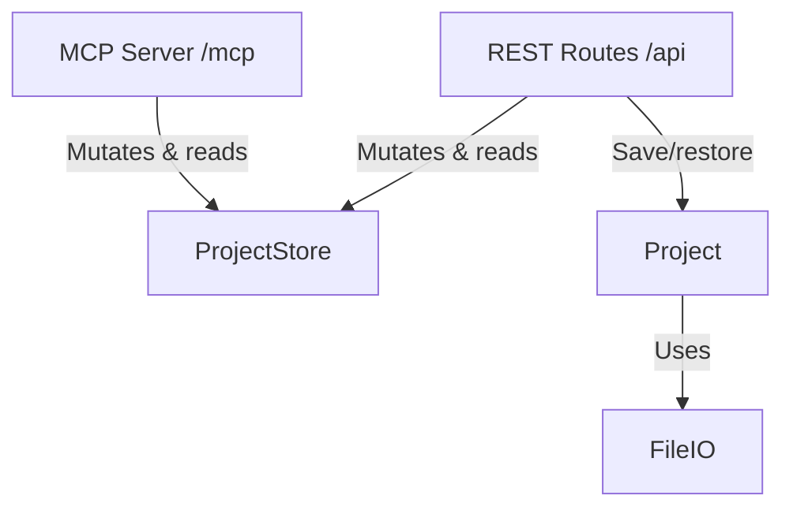

# Backend Architecture

## Description

The backend architecture consists of the following modules:

- **ProjectStore** (`src/state/projectStore.ts`): The single source of truth for the active project: the goal tree (recursive `Task`/`Plan`), the inbox of raw ideas, the active project name, and a monotonic `version` counter that increments on every mutation. It also owns the undo stack (last 50 snapshots). All mutations — from either the REST API or the MCP server — go through this store, which validates them (unknown ids, self/circular dependencies, invalid inbox indices) and throws typed errors.
- **REST Routes** (`src/routes/api.ts`): `createApiRouter(store, project)` defines the endpoints the frontend uses. Every mutation responds with the full new `ProjectState` so clients cannot drift; `GET /api/state/version` supports cheap change polling.
- **MCP Server** (`src/mcp/mcpServer.ts`): `createMcpServer(store)` registers the tools through which an external LLM (e.g. Claude Desktop) collaborates on the plan — reading state, adding/updating tasks and dependencies, managing the inbox, and undoing. Project management (listing, saving, opening, creating) is intentionally left out so those stay user-only actions in the web UI; MCP only ever operates on whichever project is currently active in the store. Served over stateless Streamable HTTP at `POST /mcp` (`src/mcp/mcpTransport.ts`): a fresh transport + server instance per request, with all real state in the shared `ProjectStore`.
- **Project** (`src/models/project.ts`): Saves and restores projects as JSON files under `./projects` (format v2: `{ formatVersion: 2, goal, inbox }`). Files in any other format open as an empty project.
- **FileIO** (`src/utils/fileIO.ts`): Thin file-system wrapper to make persistence testable.

There is no LLM integration in the backend. Concurrency is last-write-wins: the store's synchronous mutations are atomic on Node's single-threaded event loop, and undo is global (it reverts the most recent change regardless of whether it came from the UI or MCP).
