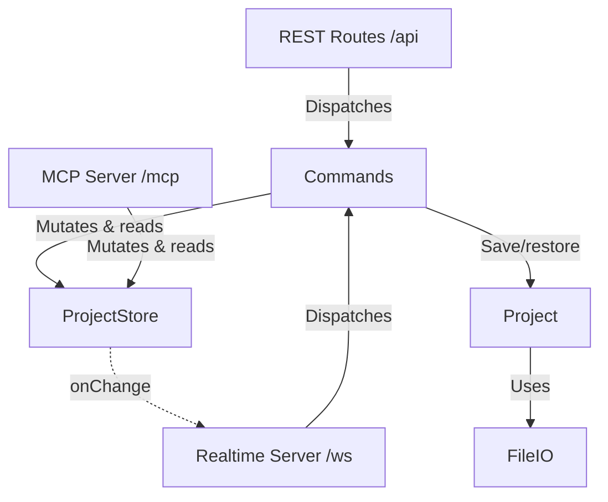

# Backend Architecture

## Description

The backend architecture consists of the following modules:

- **ProjectStore** (`src/state/projectStore.ts`): The single source of truth for the active project: the goal tree (recursive `Task`/`Plan`), the inbox of raw ideas (each `{ id, text }`, newest first), the active project name, and a monotonic `version` counter that increments on every mutation. It also owns the undo stack (last 50 snapshots, each tagged with its author) and a change emitter (`onChange`) that the realtime server subscribes to. All mutations — from either the REST API or the MCP server — go through this store, which validates them (unknown ids, self/circular dependencies, moves into a task's own descendant, unknown idea ids) and throws typed errors. Batch mutations (`addTasks`, `addIdeas`, `addDependencies`, `promoteIdeas`, `promoteAllIdeas`) resolve every reference before writing anything, so each applies as a single change with a single undo step.
- **Commands** (`src/state/commands.ts`): One table mapping every mutation name to its handler. Both the REST router and the WebSocket server dispatch through it, so the two transports cannot drift apart. Each handler returns exactly the value that goes into REST's `{ response }` envelope and the socket's `result` frame. MCP is deliberately _not_ routed through it — its tools have their own names, schemas, return shapes and a smaller surface, and it already shares the seam that matters (the store).
- **REST Routes** (`src/routes/api.ts`): `createApiRouter(store, project, deps)` registers `POST /api/<command name>` for every command plus the read endpoints. It is the fallback transport, used while the socket is down. Every mutation responds with the full new `ProjectState`; a refused write returns 409 carrying the server's authoritative state so the client can rebase.
- **Realtime Server** (`src/realtime/realtimeServer.ts`): A `ws` server at `/ws`, attached to the same HTTP server as Express. Sends a snapshot on connect, notes which browser is on each socket from its `hello` frame, executes `command` frames through the same dispatcher as REST, and broadcasts state on every store change. Broadcasts are coalesced onto the next tick, so a burst of mutations produces one clone and one frame, and a client always sees its own reply before the broadcast it caused.
- **MCP Server** (`src/mcp/mcpServer.ts`): `createMcpServer(store)` registers the tools through which an external LLM (e.g. Claude Desktop) collaborates on the plan — reading state, adding/updating/moving tasks and dependencies, managing the inbox, and undoing. Every mutating tool echoes the entity it changed, so a caller can check a write did what it meant; names are checked against `src/mcp/nameRules.ts` first, which refuses what a roadmap node cannot render and warns about the rest. Project management (listing, saving, opening, creating, deleting) is intentionally left out so those stay user-only actions in the web UI; MCP only ever operates on whichever project is currently active in the store. Served over stateless Streamable HTTP at `POST /mcp` (`src/mcp/mcpTransport.ts`): a fresh transport + server instance per request, with all real state in the shared `ProjectStore`.
- **Project** (`src/models/project.ts`): Saves, restores and deletes projects as JSON files under `./projects` (format v3: `{ formatVersion: 3, goal, inbox }`, where each inbox entry is `{ id, text }`). A v2 file records inbox ideas as bare strings, so each is given an id as it is read and written back on the next save. Files in any other format open as an empty project. Every path is built at one point, which rejects names holding a separator or a parent reference so a caller-supplied name can only ever address a file inside `./projects`.
- **FileIO** (`src/utils/fileIO.ts`): Thin file-system wrapper to make persistence testable.

## Concurrency

The store's synchronous mutations are atomic on Node's single-threaded event loop, so writes never interleave. Beyond that:

- **Attribution.** `store.runAs(author, fn)` tags a mutation with whoever caused it. An author is `{ id, kind }` — an anonymous per-browser id and whether it is a person or the assistant. There are no names and no authentication: it exists only so undo can tell one browser's work from another's. The REST router reads it from an `X-Blossom-Author` header, the socket from the connection's `hello` frame, and MCP attributes everything to a fixed assistant identity.
- **Preconditions.** Writes that overwrite text carry one. `setGoal` and `updateTask` take a `baseVersion`, captured when the local edit began rather than when it was sent. The inbox instead uses compare-and-swap on `expectedText`, so a commit cannot overwrite a change somebody else made to the same idea; `ideaId` settles _which_ idea, and `expectedText` settles whether it still says what the caller last read. A failed precondition throws `VersionConflictError`.
- **Undo** reverts whole-state snapshots, so undoing a change somebody has since built on would discard their work. When the caller has an identity and the newest change is not theirs, undo throws `UndoBlockedError` instead, saying whether it was somebody else or the assistant. Callers without an identity are unrestricted. Genuinely selective undo — rewinding your change while keeping later ones — needs an operation log with invertible operations and is not implemented.
- **Switching project** replaces what everyone connected is looking at, so `projects/new` and `projects/restore` throw `ConfirmRequiredError` (carrying how many other browsers are connected) unless the payload carries `confirmed: true`. Once the switch happens, every client is sent a `notice` frame.

State still lives only in memory: nothing is written to disk until somebody saves, so a crash loses everything since the last save.
