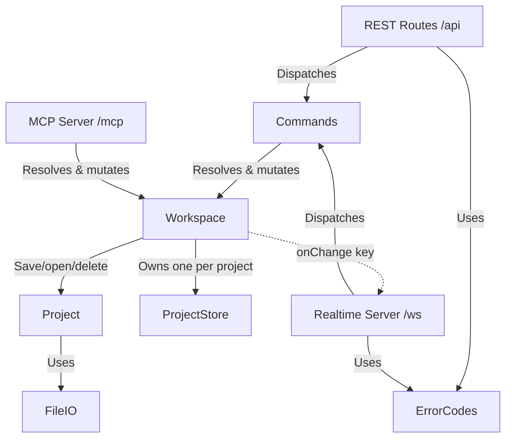

# Backend Architecture

## Description

The backend architecture consists of the following modules:

- **Workspace** (`src/state/workspace.ts`): Every project the server currently holds open, keyed by the name it answers to. It reads a project from disk the first time somebody asks for it, mints an `Untitled` key for a project with nothing saved yet, writes a project to disk and puts it under the filename it was written to, and reports which of its projects holds a given task or inbox idea. A project stays open for as long as the process runs, so two sessions asking for the same project share one copy and see each other's edits. It also holds the one project MCP acts on, chosen by a person in the web UI. Three change emitters ride on it: `onChange(key)` after every mutation to any open project, `onRename(from, to, author)` when a project starts answering to a new key, and `onAssistantTargetChange(key)` when the assistant is moved.
- **ProjectStore** (`src/state/projectStore.ts`): The single source of truth for **one** project: its goal tree (recursive `Task`/`Plan`), its inbox of raw ideas (each `{ id, text }`, newest first), the key it answers to, whether a file holds its work, and a monotonic `version` counter that increments on every mutation. It also owns that project's undo stack (last 50 snapshots, each tagged with its author) and a change emitter the Workspace subscribes to. All mutations — from either the REST API or the MCP server — go through a store, which validates them (unknown ids, self/circular dependencies, moves into a task's own descendant, unknown idea ids) and throws typed errors. Batch mutations (`addTasks`, `addIdeas`, `addDependencies`, `promoteIdeas`, `promoteAllIdeas`) resolve every reference before writing anything, so each applies as a single change with a single undo step. The key and the saved-to-disk flag are the only parts of its state written from outside, and the Workspace is the only writer of them.
- **Commands** (`src/state/commands.ts`): One table mapping every mutation name to its handler. Both the REST router and the WebSocket server dispatch through it, so the two transports cannot drift apart. Each handler returns exactly the value that goes into REST's `{ response }` envelope and the socket's `result` frame. Every project-scoped handler starts by resolving which project the payload means — see [Which project a write lands in](#which-project-a-write-lands-in). MCP is deliberately _not_ routed through it — its tools have their own names, schemas, return shapes and a smaller surface, and it already shares the seam that matters (the workspace).
- **ErrorCodes** (`src/state/errorCodes.ts`): What a failure means, in the one vocabulary both transports speak, plus the HTTP status that carries it. Statuses alone would not do: `conflict` and `undo-blocked` both return 409, so a client reading only the status cannot tell a stale precondition from an undo it is not allowed to make.
- **REST Routes** (`src/routes/api.ts`): `createApiRouter(workspace, project)` registers `POST /api/<command name>` for every command plus the read endpoints. It is the fallback transport, used while the socket is down. Every project mutation responds with that project's full new `ProjectState`; a refused write returns 409 carrying the server's authoritative copy of the project it was aimed at, so the client can rebase.
- **Realtime Server** (`src/realtime/realtimeServer.ts`): A `ws` server at `/ws`, attached to the same HTTP server as Express. Each connection carries its own **view**: the keys of the projects that session is looking at, taken from its `hello` frame and changed by a `subscribe` frame. It answers both with a snapshot of that view, executes `command` frames through the same dispatcher as REST, and sends every project change to the sessions looking at that project. Broadcasts are coalesced onto the next tick, one frame per project that changed, so a burst of mutations produces one frame each and a client always sees its own reply before the broadcast it caused.
- **MCP Server** (`src/mcp/mcpServer.ts`): `createMcpServer(workspace)` registers the tools through which an external LLM (e.g. Claude Desktop) collaborates on the plan — reading state, adding/updating/moving tasks and dependencies, managing the inbox, and undoing. Which project those tools act on is read from the workspace on each call, so moving the assistant onto another project takes effect on its next tool call. Every mutating tool echoes the entity it changed, so a caller can check a write did what it meant; names are checked against `src/mcp/nameRules.ts` first, which refuses what a roadmap node cannot render and warns about the rest. Project management (listing, saving, opening, creating, deleting) is intentionally left out so those stay user-only actions in the web UI. Served over stateless Streamable HTTP at `POST /mcp` (`src/mcp/mcpTransport.ts`): a fresh transport + server instance per request, with all real state in the shared `Workspace`.
- **Project** (`src/models/project.ts`): Saves, restores and deletes projects as JSON files under `./projects` (format v3: `{ formatVersion: 3, goal, inbox }`, where each inbox entry is `{ id, text }`), and reports whether a file holds a named project. A v2 file records inbox ideas as bare strings, so each is given an id as it is read and written back on the next save. Files in any other format open as an empty project. Every path is built at one point, which rejects names holding a separator or a parent reference so a caller-supplied name can only ever address a file inside `./projects`.
- **FileIO** (`src/utils/fileIO.ts`): Thin file-system wrapper to make persistence testable.

## Which project a write lands in

The server holds several projects open, and a session may be looking at any number of them, so every project-scoped command settles which project it means. Four things are consulted, in order:

1. **`projectKey` in the payload.** This is what the web UI sends: the person clicking knows which board lane they clicked in.
2. **A task id in the payload.** Task ids are unique across projects, so `taskId`, `parentId`, `sourceId`, `targetId`, `oldSource`, `oldTarget` or `newSource` settles it. The goal sentinel is excluded deliberately: every project has a task under that id, so it settles nothing.
3. **An `ideaId` in the payload**, which likewise belongs to exactly one project's inbox.
4. **A workspace holding exactly one project**, where there is nothing else the caller could have meant.

Anything else is refused as the ambiguity it is, with a message naming the command, asking for `projectKey`, and listing the projects that are open.

## Projects, keys and names

A project's **key** is what it answers to for as long as the server holds it open, and it is what a write names to say which project it means.

- A project with a file behind it is keyed by its filename.
- A project with nothing saved yet is keyed by a minted name — `Untitled`, `Untitled 2`, … — chosen around both the projects already open and the filenames on disk, so saving it under that name lands on a file of its own. It reports `savedToDisk: false`.
- Writing a project under another filename puts it under that filename from then on, and every session looking at it is sent a `project-renamed` notice so its board follows the project there.
- Saving under a filename another open project already holds is refused: two stores backed by one file would each overwrite the other.
- Deleting a project's file leaves an open project's work and key exactly as they are, and reports `savedToDisk: false` — the same state a project that has never been saved is in.

## Concurrency

Each store's synchronous mutations are atomic on Node's single-threaded event loop, so writes never interleave. Beyond that:

- **Attribution.** `store.runAs(author, fn)` tags a mutation with whoever caused it, and command dispatch applies it to the project the command resolved to. An author is `{ id, kind }` — an anonymous per-browser id and whether it is a person or the assistant. There are no names and no authentication: it exists only so undo can tell one browser's work from another's. The REST router reads it from an `X-Blossom-Author` header, the socket from the connection's `hello` frame, and MCP attributes everything to a fixed assistant identity.
- **Preconditions.** Writes that overwrite text carry one. `setGoal` and `updateTask` take a `baseVersion`, captured when the local edit began rather than when it was sent. The inbox instead uses compare-and-swap on `expectedText`, so a commit cannot overwrite a change somebody else made to the same idea; `ideaId` settles _which_ idea, and `expectedText` settles whether it still says what the caller last read. A failed precondition throws `VersionConflictError`.
- **Undo** is per project, and reverts whole-state snapshots, so undoing a change somebody has since built on would discard their work. When the caller has an identity and the newest change to that project is not theirs, undo throws `UndoBlockedError` instead, saying whether it was somebody else or the assistant. Callers without an identity are unrestricted. Genuinely selective undo — rewinding your change while keeping later ones — needs an operation log with invertible operations and is not implemented.
- **Opening a project** puts it on the board of the session that asked and leaves every other session's board untouched, so nothing about it needs anybody's agreement first.

State still lives only in memory: nothing is written to disk until somebody saves, so a crash loses everything since the last save.
