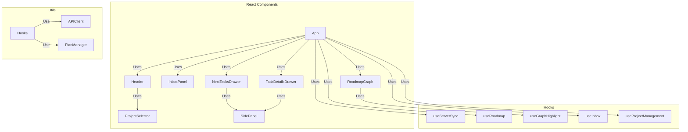

# Frontend Architecture

## Description

Conversations with an LLM happen in an external chat app connected to the backend's MCP server. The frontend is a live visual surface over the server-owned project state.

### Components

- **App**: The composition root. Wires the hooks together, registers the state fan-out targets with `useServerSync`, and renders the roadmap graph beside the inbox panel.
- **RoadmapGraph**: Visualizes the project plan as a DAG, allowing users to add, remove, rename tasks, and manage dependencies (context menu, copy/cut/paste, undo, drill-down into subplans). Double-click drills into a task's subplan; a breadcrumb built from `Roadmap.ancestors` navigates back out to any level. The viewport is refitted after every auto-layout so a freshly loaded plan is never parked off-screen.
- **InboxPanel / Inbox**: Displays the list of unorganized ideas. Ideas can be edited (committed on blur/Enter), deleted, or promoted into tasks. Ideas can also be added by an LLM through MCP.
- **SidePanel**: The docked right-hand panel shell (title, close button, fixed width) used by both drawers. It is a plain flex sibling of the canvas rather than a modal drawer, so the graph stays visible and interactive while a panel is open.
- **NextTasksDrawer / TaskDetailsDrawer**: `SidePanel` contents showing unblocked "next" tasks and the selected task's editable details.
- **Header**: The brand mark, the project selector, and Save/Reload beside a status pill carrying the connection state and the save state. Reload re-reads the saved copy, discarding changes.
- **ProjectSelector**: The project dropdown. Choosing a project loads it immediately. Each saved project carries a delete control on its own row, so a project can be cleared out without being opened first; picking it up closes the menu, since deleting asks for confirmation.
- **TextPromptDialog** / **useTextPrompt**: Asks the user for a line of text, used to name tasks and goals and to choose save filenames. The hook resolves a promise, so a call site reads as straight-line code and its context stays in scope across the await.

### Hooks

- **useServerSync**: The sync heart. Exposes `applyState(state)` which replaces the local model with a server `ProjectState`; every mutation response flows through it. It subscribes to the `RealtimeClient`, so changes made by anyone else — another person on another device, or an LLM over MCP — arrive as they happen rather than on a timer. A 10-second poll of `GET /api/state/version` runs **only while the socket is not open**, as a safety net.

    Pushed updates are guarded on the version counter: an update at or below the version already held is stale (a duplicate delivery, a reordered frame, or the echo of a change this client just made) and is dropped, which is what makes the push path idempotent. Snapshots bypass the guard, because they arrive on connect and a restarted server begins counting below whatever the client is holding.

    It also subscribes to `apiClient.onRequestFailure`. A refused write comes back with the server's authoritative state, so rebasing onto it happens here once rather than in every call site.

    It also derives `saveState` (`neverSaved` / `saved` / `unsaved`) by comparing the current state version against the one captured at the last `markSaved()`. Because the server bumps its version on every mutation, this reports unsaved work regardless of where the edit came from — including changes arriving over MCP. `useProjectManagement` calls `markSaved()` after writing to or reading from disk and `markNeverSaved()` for a project with no file behind it yet.

- **useRoadmap**: Roadmap view state and mutations. Each mutation is an async REST call whose response is applied via `applyState`. Drill-down context stays client-side.
- **useGraphHighlight**: Given the edge list and a focused node, walks outwards in both directions to return the dependency chain that node belongs to — everything it depends on plus everything depending on it. `RoadmapGraph` uses it to highlight that chain and fade the rest, which is what makes a densely connected plan readable one chain at a time. Upstream and downstream are walked separately on purpose: following edges in either direction from every visited node would drag in unrelated siblings that merely share a blocker. The dimming is applied to copies of the nodes and edges rather than to state, and `withoutDimming` strips it from anything ReactFlow's store hands back, so a focused chain can never be persisted into the real graph.
- **useInbox**: Inbox state. Keystrokes are held in a pending-edits map keyed by **idea id** and laid over the server's list, rather than replacing it — so a change arriving for a _different_ idea applies immediately while your typing survives, and ideas added or removed elsewhere in the list leave your edit exactly where it is. The panel renders rows, so the position a row hands back is resolved to an id at the hook boundary and every request names the idea by that id. If the idea you are editing changes underneath you, your text is **kept** and you are told: discarding what somebody is mid-sentence loses their work without warning, which is the failure the overlay exists to prevent. The edit is rebased onto the new value, so the next commit knowingly replaces it. Only an idea removed outright drops its edit, since there is nothing left to commit onto. Commits carry the text the idea held when editing began, as a compare-and-swap precondition. Every write to the map goes through one helper that updates the ref and the state together, because a pushed update can arrive between a state update and the render that applies it.
- **useProjectManagement**: Listing, saving, restoring and deleting projects. `applyActiveProject` follows the active project reported by the server, since anyone opening a project changes it for everybody. Deleting the project that is open leaves the work on screen with no file behind it, which is reported as `neverSaved` — the same state a project that has never been saved is in.
- **useConfirm** / **useNotices**: A yes/no question (same promise-resolving shape as `useTextPrompt`) and a transient message channel. Notices are deliberately non-blocking, since their trigger is usually somebody else's activity rather than this person's own action.

### Utilities

- **APIClient**: The single seam every request goes through. Mutations prefer the realtime socket and fall back to HTTP when it is not open; the transport is chosen once, before sending, and never switched mid-flight — these mutations are not idempotent, so retrying one whose reply went missing would duplicate the change rather than repeat it harmlessly. Reads always go over HTTP. Failures return `undefined`, and are also reported through `onRequestFailure` and recorded in `lastFailure()` so the UI can explain rather than go quiet. A `confirm-required` refusal is resolved here by asking through the registered confirm handler and resending — safe because the server declined to act rather than acting.
- **RealtimeClient**: Owns the WebSocket. Reconnects with jittered exponential backoff, resetting only after a connection has survived five seconds so a server that accepts-then-drops is not hammered. Reconnects or resyncs immediately when the tab is brought back to the front or the network returns — the two moments a person is most likely to be looking at stale state. Takes its socket from an injected factory so tests never open a real connection.
- **realtimeUrl.ts**: Derives the socket URL from `REACT_APP_API_URL` (overridable with `REACT_APP_WS_URL`), so pointing the app at another machine moves both transports at once.
- **identity.ts**: A stable, anonymous per-browser id in `localStorage`, handed to the `APIClient` on mount. Nobody is asked for anything and nothing is displayed: the id exists so undo cannot revert work that is not yours, and so a project switch knows how many other browsers it would disturb. Two tabs on one device share it, so one person counts once.
- **PlanManager**: A client-side view-model over the server-owned state: it holds a local copy of the goal tree (`applyServerState`), the drill-down context, and derived views (roadmap with task states, unblocked tasks). It performs no mutations — those go through the APIClient.

    `updateTaskStates` (in `@blossom/common`) resolves BLOCKED/UNBLOCKED/COMPLETED against a **single flat plan**; it has no notion of the tree. Nothing inside a plan can start before the task owning that plan does, so `presentContextRoadmap` closes that gap itself: it walks the drill-down path via `_hasBlockedAncestor`, and if any ancestor is blocked within its own parent's plan it downgrades the tasks this plan would otherwise offer as next up to BLOCKED. Completed work, tasks already blocked by an in-plan dependency, and dependency cycles are left alone. Without this a subplan's entry tasks render as startable even when the whole branch is gated further up. `allUnblockedTasks` enforces the same invariant independently by only recursing into subplans of UNBLOCKED tasks — keep the two consistent when changing either.

- **theme/tokens.ts**: The single source of design values — palette, radii, spacing unit, typography, shadows. These are plain objects rather than MUI theme values because the React Flow canvas draws nodes and edges outside MUI's styling and has to read the same colours directly. The palette is shaped so a dark scheme can be added without touching call sites.
- **theme/theme.ts**: Builds the MUI theme from the tokens, including component defaults (buttons are flat and not upper-cased, papers are borderless by default). Applied once in `index.tsx` via `ThemeProvider` + `CssBaseline`.
- **colors.ts**: Task and goal node colour constants, re-exported from the token palette so the canvas and the MUI surfaces cannot drift apart.
- **goalNodeUtils.tsx**: Provides utilities for creating and managing goal nodes in the roadmap graph.
- **taskNodeUtils.tsx**: Contains utilities for creating task nodes and edges in the roadmap graph, importing styling constants from TaskNode.tsx.
- **layouter.ts**: Handles the automatic layout of nodes and edges in the roadmap graph using the dagre library.
