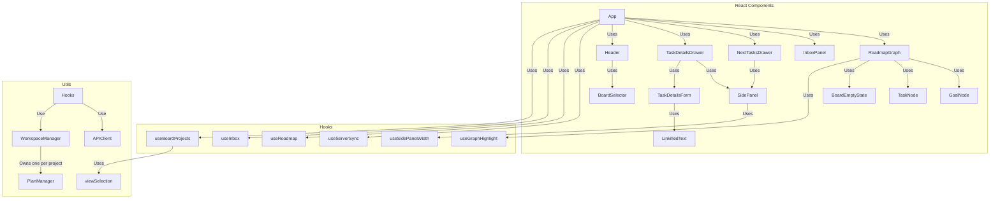

# Frontend Architecture

## Description

Conversations with an LLM happen in an external chat app connected to the backend's MCP server. The frontend is a live visual surface over the server-owned project state.

### The board

A **board** is the set of projects this session is looking at. Each project gets its own lane down the canvas, and each lane is drilled into on its own, so one project can be open at a subplan while the one beside it shows its top level. Which projects those are is this session's business: another browser can be looking at an entirely different set over the same server.

Canvas ids follow from that. A task keeps its own id, which is unique across projects. Every project names its own goal with the same sentinel, so a goal node is drawn under `Goal@<project key>` — which is what keeps two goals on one board apart. `utils/goalNodeUtils` builds and reads those ids, and `RoadmapGraph` turns a node id back into a `{ projectKey, taskId }` before asking the server about anything.

### Components

- **App**: The composition root. Wires the hooks together, registers the state fan-out targets with `useServerSync`, holds which project the canvas reports it is working in, and renders the board beside the docked panel slot.
- **RoadmapGraph**: Visualizes the board as one DAG per project, allowing users to add, remove, rename tasks, and manage dependencies (context menu, copy/cut/paste, undo, drill-down into subplans). Double-click drills into a task's subplan; a breadcrumb built from the focused lane's `Roadmap.ancestors` navigates back out to any level. Every node carries the project it belongs to, so each action lands in the lane it was made in — and the toolbar, the keyboard and paste all act on the **focused project**: the one holding whatever is picked out, and the only project on the board when nothing is. A dependency orders two tasks inside one plan, so an edge drawn from one lane to another is refused here, where both ends are known, and the person is told which two projects they joined. The viewport is refitted after every auto-layout so a freshly loaded board is never parked off-screen.
- **GoalNode**: Where a project's plan converges. It carries the project's name above the goal, so a board holding several projects says which lane belongs to which — and a project whose goal is still unnamed is identifiable from the moment it opens.
- **TaskNode**: One task's card, carrying its name, its state, a completion checkbox for a leaf and a badge for a task holding a subplan.
- **InboxPanel / Inbox**: Displays each project's list of unorganized ideas, one list per lane with its own add and move-everything controls, since an idea belongs to one plan. Ideas can be edited (committed on blur/Enter), deleted, or promoted into tasks. Every row is addressed by the idea's own id, which belongs to exactly one project — so a row says both which idea is meant and where to write it. Ideas can also be added by an LLM through MCP.
- **SidePanel**: The docked right-hand panel shell (title, close button, resizable width) used by both drawers. It is a plain flex sibling of the canvas, taking its width from the row they share, so the graph stays visible and interactive while a panel is open. Its left edge is a grab strip wired to `useSidePanelWidth`, so the boundary between canvas and panel can be dragged to give either side the room.
- **NextTasksDrawer / TaskDetailsDrawer**: `SidePanel` contents showing the unblocked "next" tasks across every project on the board, and the selected task's editable details. Each names the project it belongs to when the board holds more than one.
- **TaskDetailsForm**: The task's name, description and completion state, with an Update button that applies the edit to the task. The description reads as formatted text carrying clickable links, and swaps in a textarea when the edit button beside its heading is pressed or the text itself is clicked; blur or Escape returns to the reading view. The edit button is what carries the affordance for keyboard and screen reader users, since the reading view holds links and so cannot itself be a button. `TaskDetailsDrawer` keys the form on the task id, so switching tasks lands on the reading view.
- **LinkifiedText**: Renders plain text with the web addresses in it as links that open in a new tab, preserving line breaks. `utils/linkify` does the splitting: it recognises `http`, `https` and bare `www.` addresses, gives `www.` addresses an `https` scheme, and keeps punctuation that closes the surrounding sentence out of the URL.
- **Header**: The brand mark, the board selector, and Save/Reload beside a status pill carrying the connection state and the save state. Save and Reload act on the focused project and name it once the board holds more than one; Reload re-reads that project's saved copy, discarding changes.
- **BoardSelector**: Chooses what the board shows. Several projects can be shown at once, each getting its own lane, so each row carries its own checkbox. A project open on the board with nothing saved for it appears among them, since the list is about what is on the board. Each row also carries the control that hands the project to the assistant — a choice shared with everybody, so it sits apart from the checkbox that only affects this board — and, for a saved project, its own delete control; picking that up closes the menu, since deleting asks for confirmation.
- **BoardEmptyState**: Shown while the board holds no projects, saying that the projects menu in the header is where they are chosen.
- **CanvasEmptyState**: Shown for a single project whose goal has yet to be named, since everything else hangs off the goal.
- **TextPromptDialog** / **useTextPrompt**: Asks the user for a line of text, used to name tasks and goals and to choose save filenames. The hook resolves a promise, so a call site reads as straight-line code and its context stays in scope across the await.

### Hooks

- **useServerSync**: The sync heart. Exposes `applyView(view)`, which replaces the board with the projects the server says this session holds, and `applyProject(state)`, which applies one project's change and leaves the others alone; every mutation response flows through the latter. It subscribes to the `RealtimeClient`, so changes made by anyone else — another person on another device, or an LLM over MCP — arrive as they happen rather than on a timer. A 10-second poll of `GET /api/view/versions` runs **only while the socket is not open**, as a safety net, and reads the whole board back when any project's version has moved.

    Versions are tracked per project, since each project counts its own changes. Pushed updates are guarded on them: an update at or below the version already held for that project is stale (a duplicate delivery, a reordered frame, or the echo of a change this client just made) and is dropped, which is what makes the push path idempotent. Snapshots of the whole board bypass the guard, because they arrive on connect and a restarted server begins counting below whatever the client is holding.

    It also subscribes to `apiClient.onRequestFailure`. A refused write comes back with the server's authoritative copy of the project it was aimed at, so rebasing onto it happens here once rather than in every call site.

    `saveStateOf(key)` reports where one project stands against disk (`neverSaved` / `saved` / `unsaved`) by comparing its current version against the one captured at the last `markSaved(key)`. Because the server bumps a project's version on every mutation to it, this reports unsaved work regardless of where the edit came from — including changes arriving over MCP. `useBoardProjects` calls `markSaved(key)` after writing a project to disk or reading it from disk, and a project reporting `savedToDisk: false` is `neverSaved` outright.

- **useRoadmap**: Board state and mutations. Each mutation names the project it lands in and is an async REST call whose response is applied via `applyProject`. Drill-down context stays client-side, per project.
- **useInbox**: The inbox of every project on the board. Keystrokes are held in a pending-edits map keyed by **idea id** and laid over the server's lists, rather than replacing them — so a change arriving for a _different_ idea applies immediately while your typing survives, and ideas added or removed elsewhere in a list leave your edit exactly where it is. Only the projects whose inboxes arrived are reconciled, so an edit in another project's inbox has heard nothing that bears on it. If the idea you are editing changes underneath you, your text is **kept** and you are told: discarding what somebody is mid-sentence loses their work without warning, which is the failure the overlay exists to prevent. The edit is rebased onto the new value, so the next commit knowingly replaces it. An idea removed outright drops its edit, since there is nothing left to commit onto. An idea that already reads exactly as the edit would leave it drops its edit **in silence** — that is the state every commit lands in, since the reply it applies carries the text it just wrote, and there is no divergence to report. Commits carry the text the idea held when editing began, as a compare-and-swap precondition. Every write to the map goes through one helper that updates the ref and the state together, because a pushed update can arrive between a state update and the render that applies it.
- **useBoardProjects**: Which projects this session has on its board, and the housekeeping that goes with them: listing what is saved, opening and closing lanes, starting new projects, saving, reloading and deleting, and choosing which project MCP works on. Every change to the board is recorded through `viewSelection` and declared to the server. Opening a project puts it on this board and leaves every other browser exactly where it was, which is why none of it needs anybody's agreement first. It also follows the `project-renamed` notice, so a project written under another filename keeps its lane and the link keeps naming it.
- **useGraphHighlight**: Given the edge list and a focused node, walks outwards in both directions to return the dependency chain that node belongs to — everything it depends on plus everything depending on it. `RoadmapGraph` uses it to highlight that chain and fade the rest, which is what makes a densely connected board readable one chain at a time. Upstream and downstream are walked separately on purpose: following edges in either direction from every visited node would drag in unrelated siblings that merely share a blocker. The dimming is applied to copies of the nodes and edges rather than to state, and `withoutDimming` strips it from anything ReactFlow's store hands back, so a focused chain can never be persisted into the real graph.
- **useSidePanelWidth**: How wide the docked panel is, and the drag that changes it. Supplies the props for the grab strip on the panel's left edge: a pointer drag moves the boundary, arrow keys move it 16px at a time, and a double click returns it to 340px. The pointer is captured on grab, so the drag follows it across the whole window. Widths are clamped to 260–800px and kept in `localStorage`, so the slot opens at the size last chosen whichever panel fills it.
- **useConfirm** / **useNotices**: A yes/no question (same promise-resolving shape as `useTextPrompt`) and a transient message channel. Notices are deliberately non-blocking, since their trigger is usually somebody else's activity rather than this person's own action.

### Utilities

- **APIClient**: The single seam every request goes through. Every write names the project it means with `projectKey` — the person clicking knows which lane they clicked in, so the server does not have to guess. Mutations prefer the realtime socket and fall back to HTTP when it is not open; the transport is chosen once, before sending, and never switched mid-flight — these mutations are not idempotent, so retrying one whose reply went missing would duplicate the change. Reads always go over HTTP. Failures return `undefined`, and are also reported through `onRequestFailure` and recorded in `lastFailure()` so the UI can explain rather than go quiet.
- **RealtimeClient**: Owns the WebSocket. Carries the projects this session is looking at, sending them in the `hello` frame and in every `subscribe`, and holding them so a reconnection lands back on the same board. Reconnects with jittered exponential backoff, resetting only after a connection has survived five seconds so a server that accepts-then-drops is not hammered. Reconnects or resyncs immediately when the tab is brought back to the front or the network returns — the two moments a person is most likely to be looking at stale state. It also follows a `project-renamed` notice, so the board keeps asking for the key the server now knows a project by. Takes its socket from an injected factory so tests never open a real connection.
- **viewSelection.ts**: Which projects this session is looking at, recorded in the address bar (`?projects=trip,house`) and in `localStorage`. The address bar wins, so a board can be sent to somebody as a link and opened on another device; with nothing there, the last board this browser was on is used, so reopening the app lands back where the person left off. The history entry is replaced: picking projects is arranging one board, and the back button belongs to wherever the person came from.
- **realtimeUrl.ts**: Derives the socket URL from `REACT_APP_API_URL` (overridable with `REACT_APP_WS_URL`), so pointing the app at another machine moves both transports at once.
- **identity.ts**: A stable, anonymous per-browser id in `localStorage`, handed to the `APIClient` on mount. Nobody is asked for anything and nothing is displayed: the id exists so undo cannot revert work that is not yours. Two tabs on one device share it, so one person counts once.
- **WorkspaceManager**: A client-side view-model over every project this session is looking at, holding one `PlanManager` per lane plus the lane order and which project the assistant works on. It assembles the `Board` the canvas draws, collects the startable tasks across every project, and resolves a task id to the project holding it. It performs no mutations — those go through the APIClient — and holds no React state.
- **PlanManager**: The view-model for **one** project: a local copy of its goal tree (`applyServerState`), the level it is drilled into, and derived views (roadmap with task states, unblocked tasks). Each task it hands out carries the project it came from. A project written under another filename keeps its tree and its drill-down through `setProjectKey`, so a save leaves the person where they were.

    `updateTaskStates` (in `@blossom/common`) resolves BLOCKED/UNBLOCKED/COMPLETED against a **single flat plan**; it has no notion of the tree. Nothing inside a plan can start before the task owning that plan does, so `presentContextRoadmap` closes that gap itself: it walks the drill-down path via `_hasBlockedAncestor`, and if any ancestor is blocked within its own parent's plan it downgrades the tasks this plan would otherwise offer as next up to BLOCKED. Completed work, tasks already blocked by an in-plan dependency, and dependency cycles are left alone. Without this a subplan's entry tasks render as startable even when the whole branch is gated further up. `allUnblockedTasks` enforces the same invariant independently by only recursing into subplans of UNBLOCKED tasks — keep the two consistent when changing either.

- **layouter.ts**: Places every node on the board. It groups nodes by the project each carries, lays each project out on its own with dagre from the dependencies inside it, and stacks the results down the canvas as bands — so a board holding several projects reads as one lane per project, and the plan inside a lane is laid out exactly as it would be on a board of its own. The lane order is passed in, so a project's band stays where the session put it however the graph changes underneath.
- **theme/tokens.ts**: The single source of design values — palette, radii, spacing unit, typography, shadows. These are plain objects rather than MUI theme values because the React Flow canvas draws nodes and edges outside MUI's styling and has to read the same colours directly. The palette is shaped so a dark scheme can be added without touching call sites.
- **theme/theme.ts**: Builds the MUI theme from the tokens, including component defaults (buttons are flat and not upper-cased, papers are borderless by default). Applied once in `index.tsx` via `ThemeProvider` + `CssBaseline`.
- **colors.ts**: Task and goal node colour constants, re-exported from the token palette so the canvas and the MUI surfaces cannot drift apart.
- **goalNodeUtils.tsx**: Builds a project's goal node, and builds and reads the canvas ids that keep one board's goals apart.
- **taskNodeUtils.tsx**: Contains utilities for creating task nodes and edges in the roadmap graph, importing styling constants from TaskNode.tsx.
