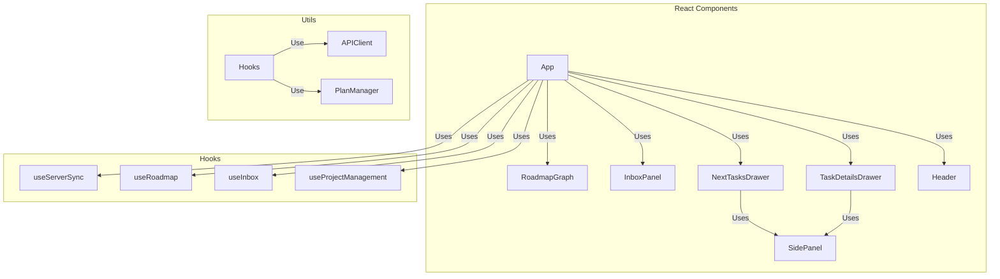

# Frontend Architecture

## Description

The frontend has no chat window: conversations with an LLM happen in an external chat app connected to the backend's MCP server. The frontend is a live visual surface over the server-owned project state.

### Components

- **App**: The composition root. Wires the hooks together, registers the state fan-out targets with `useServerSync`, and renders the roadmap graph beside the inbox panel.
- **RoadmapGraph**: Visualizes the project plan as a DAG, allowing users to add, remove, rename tasks, and manage dependencies (context menu, copy/cut/paste, undo, drill-down into subplans). Double-click drills into a task's subplan; a breadcrumb built from `Roadmap.ancestors` navigates back out to any level. The viewport is refitted after every auto-layout so a freshly loaded plan is never parked off-screen.
- **InboxPanel / Inbox**: Displays the list of unorganized ideas. Ideas can be edited (committed on blur/Enter), deleted, or promoted into tasks. Ideas can also be added by an LLM through MCP.
- **SidePanel**: The docked right-hand panel shell (title, close button, fixed width) used by both drawers. It is a plain flex sibling of the canvas rather than a modal drawer, so the graph stays visible and interactive while a panel is open.
- **NextTasksDrawer / TaskDetailsDrawer**: `SidePanel` contents showing unblocked "next" tasks and the selected task's editable details.
- **Header**: Project selection dropdown plus Save/Reload buttons. Choosing a project in the dropdown loads it immediately; Reload re-reads the saved copy, discarding changes.

### Hooks

- **useServerSync**: The sync heart. Exposes `applyState(state)` which replaces the local model with a server `ProjectState`; every REST mutation response flows through it. It also polls `GET /api/state/version` every 3 seconds and refetches the full state when the version moved — this is how edits made through MCP (e.g. by Claude Desktop) appear in the UI without a reload. Polling is paused while the user is mid-edit in the inbox.
- **useRoadmap**: Roadmap view state and mutations. Each mutation is an async REST call whose response is applied via `applyState`. Drill-down context stays client-side.
- **useInbox**: Inbox state; keystroke edits stay local (with polling paused) and commit on blur/Enter.
- **useProjectManagement**: Listing, saving, and restoring projects.

### Utilities

- **APIClient**: HTTP client for the backend REST API. Mutations return the full new `ProjectState`.
- **PlanManager**: A client-side view-model over the server-owned state: it holds a local copy of the goal tree (`applyServerState`), the drill-down context, and derived views (roadmap with task states, unblocked tasks). It performs no mutations — those go through the APIClient.

  `updateTaskStates` (in `@blossom/common`) resolves BLOCKED/UNBLOCKED/COMPLETED against a **single flat plan**; it has no notion of the tree. Nothing inside a plan can start before the task owning that plan does, so `presentContextRoadmap` closes that gap itself: it walks the drill-down path via `_hasBlockedAncestor`, and if any ancestor is blocked within its own parent's plan it downgrades the tasks this plan would otherwise offer as next up to BLOCKED. Completed work, tasks already blocked by an in-plan dependency, and dependency cycles are left alone. Without this a subplan's entry tasks render as startable even when the whole branch is gated further up. `allUnblockedTasks` enforces the same invariant independently by only recursing into subplans of UNBLOCKED tasks — keep the two consistent when changing either.
- **colors.ts**: Contains color constants for task nodes (completed, blocked, unblocked) and goal nodes.
- **goalNodeUtils.tsx**: Provides utilities for creating and managing goal nodes in the roadmap graph.
- **taskNodeUtils.tsx**: Contains utilities for creating task nodes and edges in the roadmap graph, importing styling constants from TaskNode.tsx.
- **layouter.ts**: Handles the automatic layout of nodes and edges in the roadmap graph using the dagre library.
