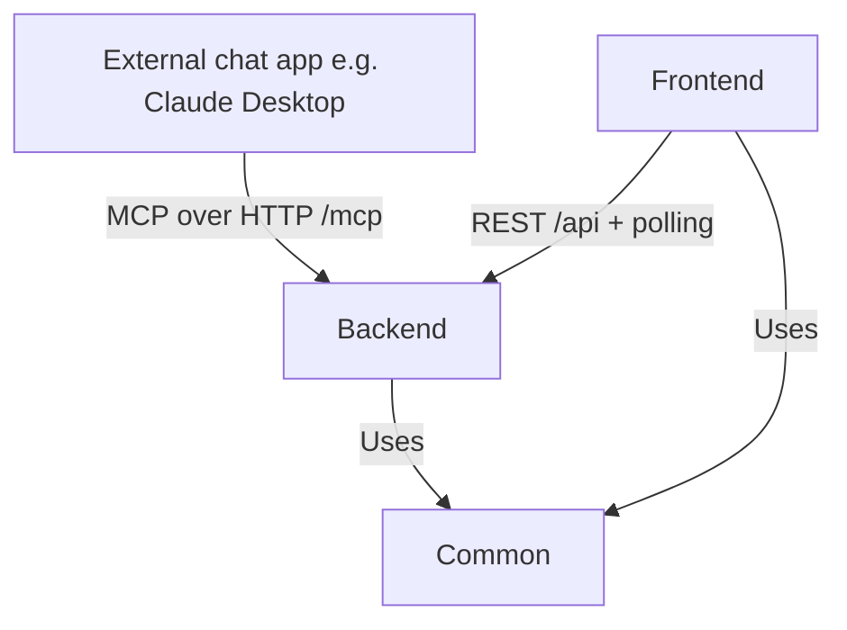

# High Level Overview

There is no LLM inside the application. Instead, the backend exposes an **MCP (Model Context Protocol) server** so that any external chat application (e.g. Claude Desktop) can act as the conversational interface. The LLM collaborates on the project plan by calling MCP tools; the frontend visualizes the same state and picks up external changes by polling a version counter.

## Common Package

The Common package contains the shared domain types (`Task`, `Plan`, `Dependency`, `ProjectState`) plus pure graph logic (`hasCircularDependencies`, `updateTaskStates`) used by both the Frontend and the Backend.

## Backend Package

The Backend is the single source of truth for project state (`ProjectStore`). It exposes the same state through two front doors: a REST API used by the Frontend, and an MCP server used by external chat applications. It also persists projects to disk, driven only by the Frontend, never by MCP.

For details on the API endpoints and MCP tools, refer to the [API Endpoints](./api.md) document.

For more information on the backend architecture, refer to the [Backend Architecture](./backend.md) document.

## Frontend Package

The Frontend visualizes the project plan as a roadmap graph, shows the inbox of raw ideas, allows editing tasks/dependencies, and saving/restoring projects. There is no chat window — conversations happen in the external chat app connected via MCP.

For more information on the frontend architecture, refer to the [Frontend Architecture](./frontend.md) document.

## Sequence Diagrams

For detailed sequence diagrams, see the [Sequence Diagrams](./sequences.md) document.
