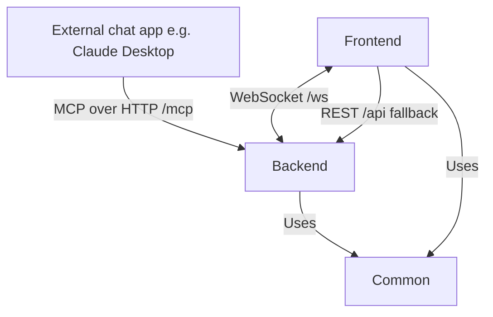

# High Level Overview

The backend exposes an **MCP (Model Context Protocol) server** so that any external chat application (e.g. Claude Desktop) acts as the conversational interface. The LLM collaborates on the project plan by calling MCP tools; every frontend looking at that project is **pushed** each change over a WebSocket as it happens, whoever made it.

## Common Package

The Common package contains the shared domain types (`Task`, `Plan`, `Dependency`, `ProjectState`, `ViewState`) plus pure graph logic (`hasCircularDependencies`, `updateTaskStates`) used by both the Frontend and the Backend.

## Backend Package

The Backend is the single source of truth for project state. It holds several projects open at once in a `Workspace`, each with its own `ProjectStore`, and exposes them through two front doors: a REST API used by the Frontend, and an MCP server used by external chat applications. It also persists projects to disk, driven only by the Frontend, never by MCP.

For details on the API endpoints and MCP tools, refer to the [API Endpoints](./api.md) document.

For more information on the backend architecture, refer to the [Backend Architecture](./backend.md) document.

## Frontend Package

The Frontend visualizes project plans as roadmap graphs, shows each project's inbox of raw ideas, allows editing tasks/dependencies, and saving/restoring projects. Conversations happen in the external chat app connected via MCP.

## Boards

A **board** is the set of projects one session is looking at. Each project gets its own lane down the canvas, drawn from the plan level that project is drilled into, so several plans read at once and each is navigated on its own.

Every session keeps its own board. Two people can sit on different projects, or on different combinations of them, over one server: opening a project puts it on the board of the browser that asked and leaves everybody else's alone. Two sessions that hold the same project share one copy of it and see each other's edits as they land.

A board is recorded in the address bar (`?projects=trip,house`) and in `localStorage`, so a link opens the board it names and reopening the app lands back where the person left off.

## Several people at once

Several people can work on a project at once, from different devices. There are no accounts and nobody is asked for a name: each browser holds an anonymous id in `localStorage` purely so changes can be told apart, and sends its mutations over the same socket it receives them on.

The assistant works on one project, chosen by a person from the projects menu in the web UI. That choice is the same for everybody, so an assistant writing to a plan and the people reading it are looking at the same thing without either having to follow the other around.

For more information on the frontend architecture, refer to the [Frontend Architecture](./frontend.md) document.

## Sequence Diagrams

For detailed sequence diagrams, see the [Sequence Diagrams](./sequences.md) document.
