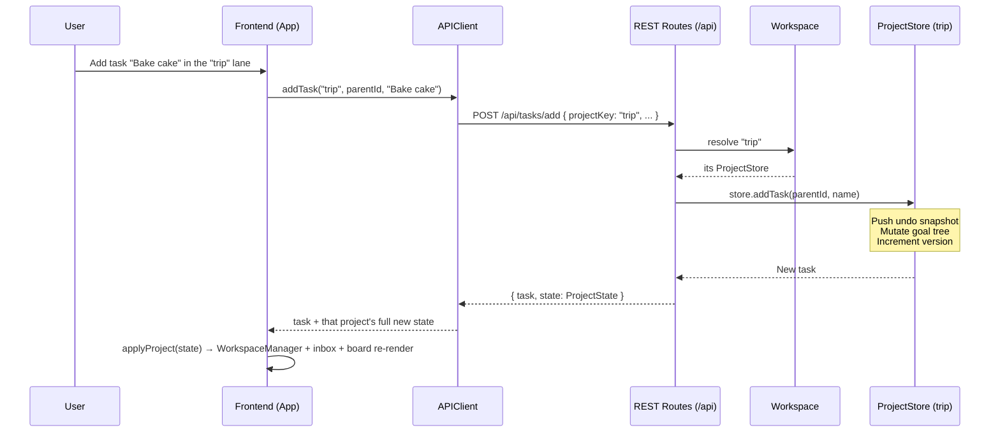
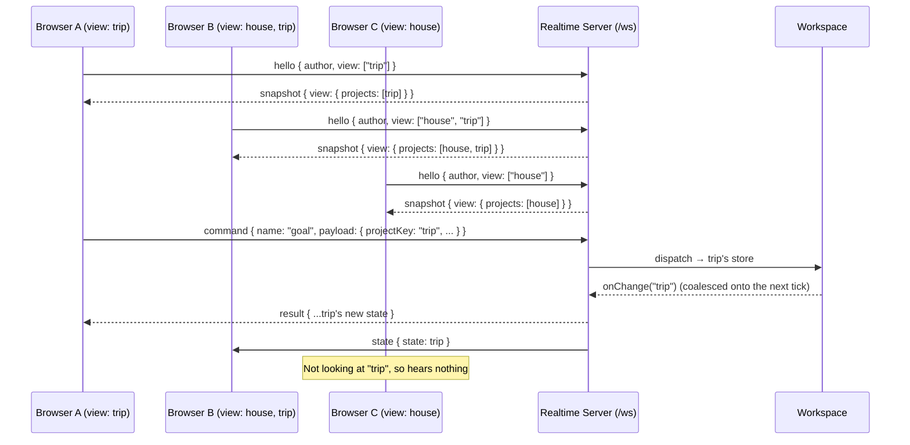
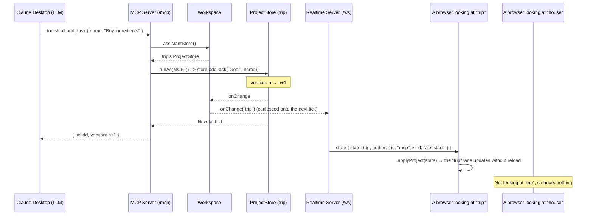
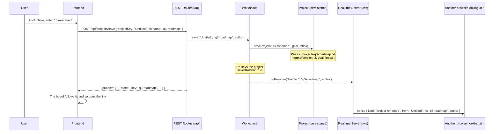
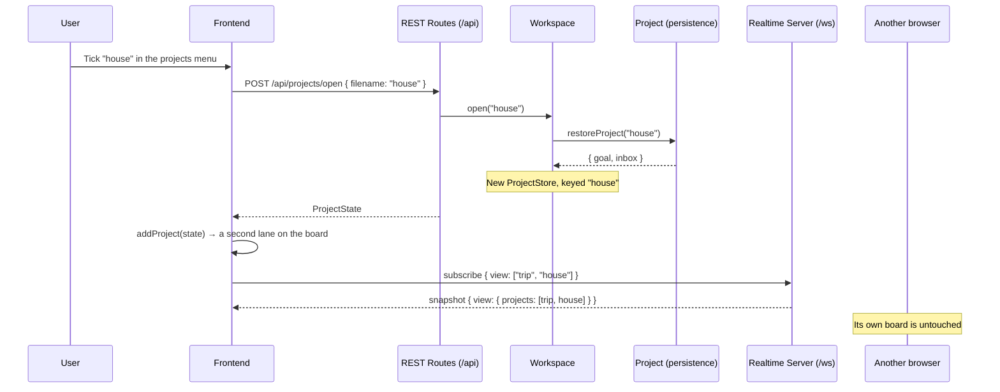
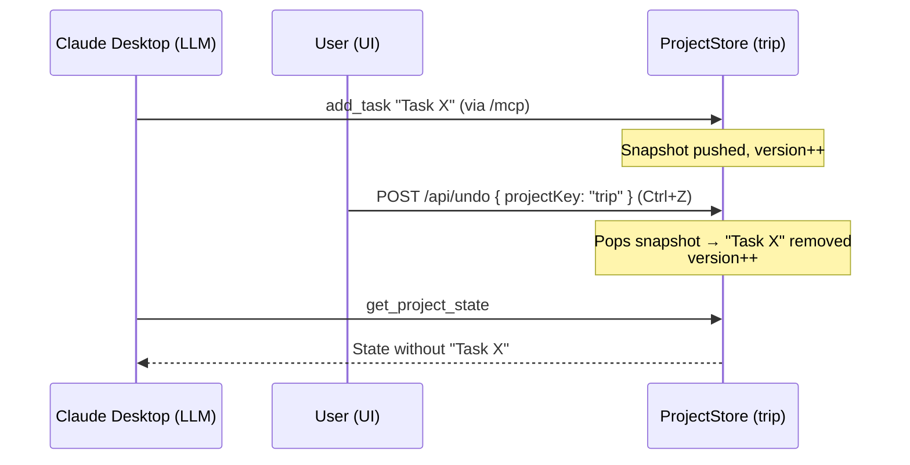

# High-Level Sequence Diagrams

The following sequence diagrams illustrate how state flows between the frontend, the backend, and an external LLM connected via MCP.

# User Edits the Plan in the UI

# Two Sessions Looking at Different Boards

A `state` frame reaches only the sessions whose view holds the project that changed.

# External LLM Edits the Plan via MCP

The assistant works on the one project a person chose for it in the web UI.

# Saving a Project Under a New Name

Writing a project to disk puts it under the filename it was written to, so every session looking at it is told which key to use from then on.

# Opening a Project onto One Board

Opening a project is a per-session act: it puts the project on the board of the browser that asked and leaves every other board alone.

# Undo with Two Writers

Undo is per project: each store's undo stack records every mutation to that project regardless of author, so a UI Ctrl+Z can revert an MCP edit and the MCP `undo_last_change` tool can revert a UI edit — within the one project each is working on.

