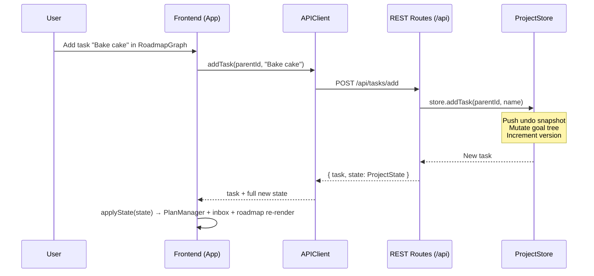
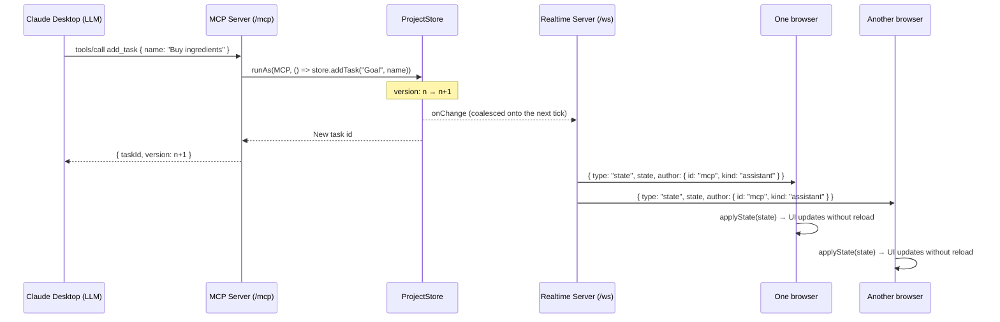
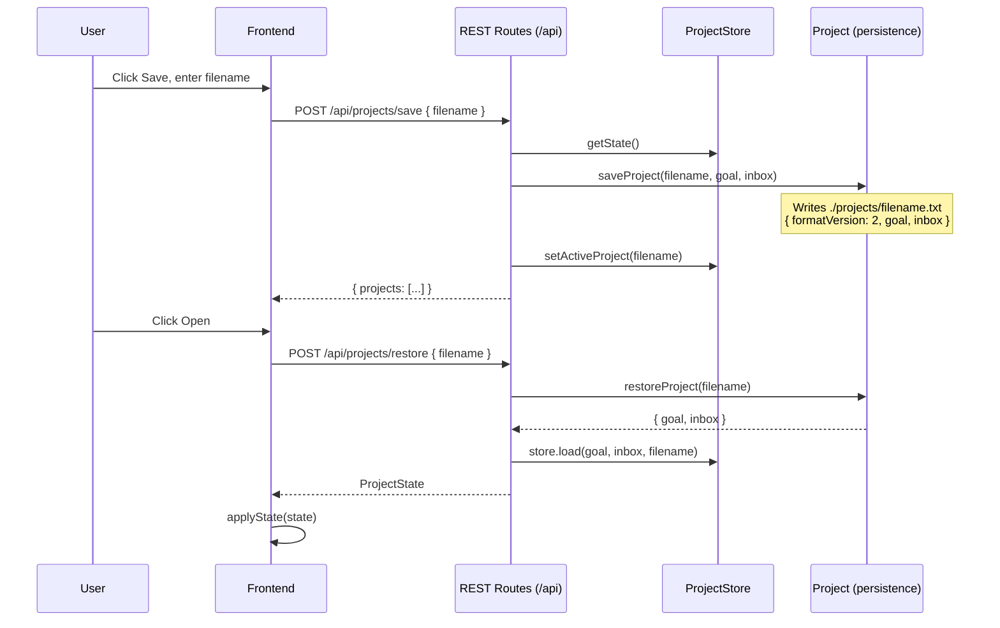
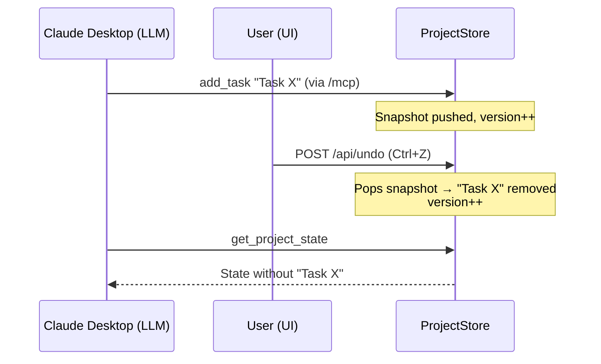

# High-Level Sequence Diagrams

The following sequence diagrams illustrate how state flows between the frontend, the backend, and an external LLM connected via MCP.

# User Edits the Plan in the UI

# External LLM Edits the Plan via MCP

# Saving and Restoring a Project

# Undo with Two Writers

Undo is global: the store's undo stack records every mutation regardless of author, so a UI Ctrl+Z can revert an MCP edit and the MCP `undo_last_change` tool can revert a UI edit.

